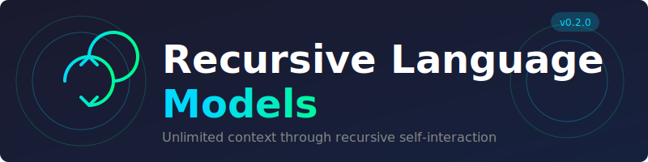
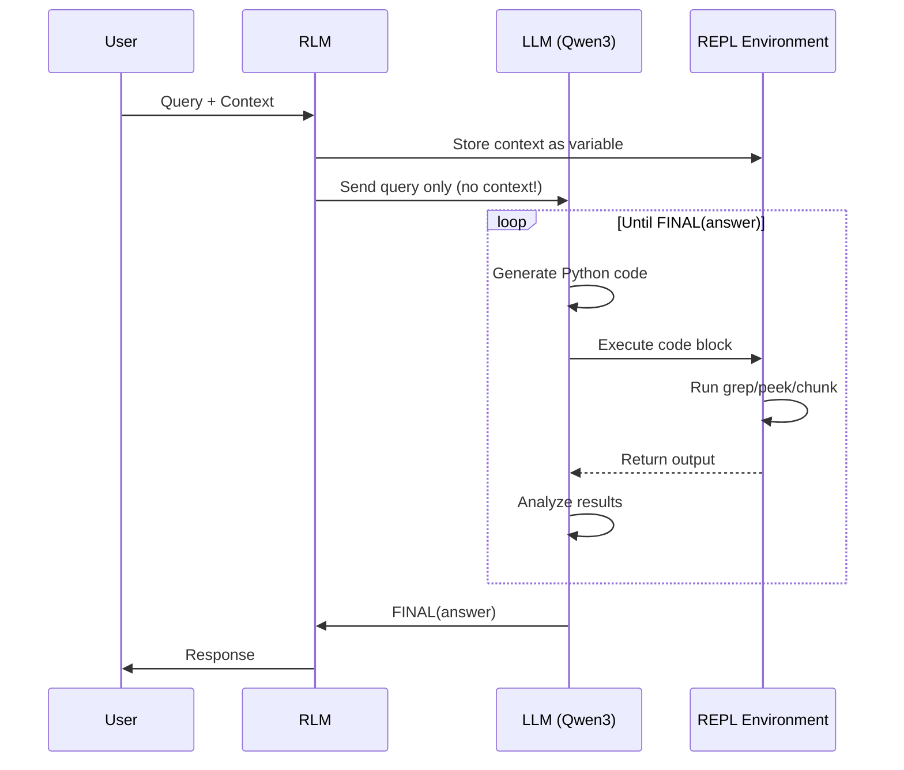

<p align="center">
  
</p>

<h1 align="center">🔄 Recursive Language Models (RLM)</h1>

<p align="center">
  <strong>Handle unlimited context through recursive self-interaction</strong>
</p>

<p align="center">
  <a href="#-quick-start">Quick Start</a> •
  <a href="#-architecture">Architecture</a> •
  <a href="#-features">Features</a> •
  <a href="#-examples">Examples</a> •
  <a href="#-enhancements">Enhancements</a>
</p>

<p align="center">
  
  
  
  
</p>

---

## 📖 What is RLM?

**Recursive Language Models (RLMs)** solve a fundamental problem in AI: **context rot**. As context windows grow larger, LLMs progressively lose the ability to accurately recall and reason about information. RLMs address this by allowing the LLM to **programmatically interact** with its context through a REPL environment.

> 💡 **Key Insight**: Instead of forcing an LLM to process a massive context directly, let it write code to explore, search, and decompose the context recursively.

### Research Background

This implementation is based on the groundbreaking research:

| Resource | Link |
|----------|------|
| 📄 **Paper** | [Recursive Language Models (arXiv)](https://arxiv.org/abs/2512.24601) |
| 📝 **Blog** | [RLM Blogpost](https://alexzhang13.github.io/blog/2025/rlm/) |
| 💻 **Official Code** | [github.com/alexzhang13/rlm](https://github.com/alexzhang13/rlm) |

---

## 🏗️ Architecture

### How RLM Works

```
┌─────────────────────────────────────────────────────────────────────────┐
│                           USER QUERY                                     │
│                    "Find all errors in the logs"                        │
└─────────────────────────────┬───────────────────────────────────────────┘
                              │
                              ▼
┌─────────────────────────────────────────────────────────────────────────┐
│                         RLM LAYER                                        │
│  ┌────────────────────────────────────────────────────────────────────┐ │
│  │                    ROOT LLM (Qwen3)                                 │ │
│  │                                                                     │ │
│  │   ⚠️  The LLM NEVER sees the full context directly!                │ │
│  │   ✅  It only receives the query + REPL environment access         │ │
│  └────────────────────────────┬───────────────────────────────────────┘ │
│                               │                                          │
│                               ▼                                          │
│  ┌────────────────────────────────────────────────────────────────────┐ │
│  │                   REPL ENVIRONMENT                                  │ │
│  │  ┌──────────────────────────────────────────────────────────────┐  │ │
│  │  │  context = "... 10M+ tokens of logs ..."                     │  │ │
│  │  │                                                               │  │ │
│  │  │  📦 Available Functions:                                      │  │ │
│  │  │  ├── peek(start, length) → View portion of context           │  │ │
│  │  │  ├── grep(pattern) → Search with regex                       │  │ │
│  │  │  ├── chunk(size) → Split into chunks                         │  │ │
│  │  │  ├── head(n) / tail(n) → First/last n lines                  │  │ │
│  │  │  └── ask_llm(prompt) → Recursive sub-LLM calls               │  │ │
│  │  └──────────────────────────────────────────────────────────────┘  │ │
│  └────────────────────────────────────────────────────────────────────┘ │
└─────────────────────────────┬───────────────────────────────────────────┘
                              │
                              ▼
┌─────────────────────────────────────────────────────────────────────────┐
│                      FINAL(answer)                                       │
│                   "Found 47 errors..."                                   │
└─────────────────────────────────────────────────────────────────────────┘
```

### Execution Flow



### Why RLM Outperforms Traditional Approaches

```
Traditional LLM:
┌──────────────────────────────────────────────────────────┐
│  Query + 10M tokens of context → Single LLM call         │
│                                                          │
│  Problems:                                               │
│  ❌ Context rot: Model "forgets" earlier content         │
│  ❌ Expensive: Pay for all tokens every time             │
│  ❌ Slow: Process entire context each query              │
│  ❌ Limited: Hard context window limits                  │
└──────────────────────────────────────────────────────────┘

RLM Approach:
┌──────────────────────────────────────────────────────────┐
│  Query only → LLM writes code → Explore context          │
│                                                          │
│  Benefits:                                               │
│  ✅ No context rot: Each call is small & focused         │
│  ✅ Cost efficient: Only process relevant chunks         │
│  ✅ Fast: grep/search is O(n), not O(n²) attention       │
│  ✅ Unlimited: Handle any context size                   │
└──────────────────────────────────────────────────────────┘
```

---

## 🚀 Quick Start

### Prerequisites

- **Python 3.10+**
- **Ollama** with a model (Qwen3 recommended)

```bash
# Install Ollama
curl -fsSL https://ollama.com/install.sh | sh

# Pull a model
ollama pull qwen3:0.6b   # Lightweight, fast
# OR
ollama pull qwen3:latest # Full 8B model
```

### Installation

```bash
# Clone the repository
git clone https://github.com/YOUR_USERNAME/recursive-language-models.git
cd recursive-language-models

# Run setup script
chmod +x setup.sh
./setup.sh

# OR manual setup
python3 -m venv venv
source venv/bin/activate
pip install -r requirements.txt
cp .env.example .env
```

### Basic Usage

```python
from rlm import RLM

# Initialize with local Ollama
rlm = RLM(verbose=True)

# Process a large context
context = open("large_log_file.txt").read()  # Can be 10M+ characters!

result = rlm.completion(
    query="Find all ERROR entries and count them by type",
    context=context
)

print(result.response)
print(f"Tokens used: {result.total_tokens}")
print(f"Iterations: {result.total_iterations}")
```

---

## ✨ Features

### Core Features

| Feature | Description |
|---------|-------------|
| **🔄 Recursive Self-Calls** | LLM can spawn sub-queries for complex reasoning |
| **🐍 Python REPL** | Execute code to explore context programmatically |
| **🔍 Built-in Helpers** | `grep`, `peek`, `chunk`, `head`, `tail` functions |
| **📝 Trajectory Logging** | Full execution history saved as JSON |
| **🔒 Sandboxed Execution** | Safe code execution with restricted imports |

### Enhanced Features (Production-Ready)

| Enhancement | Module | Description |
|-------------|--------|-------------|
| **⚡ Async/Parallel** | `async_rlm.py` | Process chunks concurrently (3-5x speedup) |
| **📡 Streaming** | `streaming.py` | Real-time token output |
| **💰 Budget Controls** | `budget.py` | Token/cost limits with auto-termination |
| **🔍 RAG Integration** | `rag.py` | Semantic search pre-filtering |

---

## 📂 Project Structure

```
recursive-language-models/
│
├── 📁 rlm/                     # Core Package
│   ├── __init__.py             # Package exports
│   ├── rlm_core.py             # Main RLM implementation
│   ├── repl.py                 # Python REPL environment
│   ├── ollama_client.py        # Ollama API client
│   │
│   └── 📁 enhancements/        # Production features
│       ├── async_rlm.py        # Async/parallel execution
│       ├── streaming.py        # Real-time streaming
│       ├── budget.py           # Token budget controls
│       └── rag.py              # RAG integration
│
├── 📁 assets/                  # Images and diagrams
│
├── main.py                     # Basic examples
├── demo_enhancements.py        # Enhancement demos
├── requirements.txt            # Dependencies
├── setup.sh                    # Setup script
├── .env.example                # Configuration template
└── README.md                   # This file
```

---

## 💡 Examples

### Example 1: Needle in a Haystack

Find a hidden number in 1M+ lines of text:

```python
from rlm import RLM
import random

# Generate huge context with hidden number
lines = ["Random text line " * 10 for _ in range(100000)]
secret = random.randint(100000, 999999)
lines[50000] = f"SECRET: The answer is {secret}"
context = "\n".join(lines)

rlm = RLM(verbose=True)
result = rlm.completion(
    query="Find the secret number in the text",
    context=context  # ~5MB of text!
)

print(f"Found: {result.response}")  # Correctly finds the number!
```

### Example 2: Multi-hop Reasoning

Answer questions requiring multiple document lookups:

```python
from rlm import RLM

context = """
Product P001: Widget A, Price: $50, Manager: Alice
Product P002: Widget B, Price: $75, Manager: Bob
Sale S001: Product P001, Quantity: 100
Sale S002: Product P002, Quantity: 50
Manager Alice: Bonus Rate 5%
Manager Bob: Bonus Rate 3%
"""

rlm = RLM()
result = rlm.completion(
    query="Calculate total potential bonus for Alice based on her products' sales",
    context=context
)
# RLM will: 1) Find Alice's products 2) Find sales 3) Calculate revenue 4) Apply bonus rate
```

### Example 3: With RAG Pre-filtering

Combine semantic search with RLM for optimal performance:

```python
from rlm import RAGEnhancedRLM

# Load large document
annual_report = open("10k_report.txt").read()  # 500+ pages

rag_rlm = RAGEnhancedRLM(
    chunk_size=2000,
    top_k=5,
    min_relevance=0.1
)

result = rag_rlm.completion(
    query="What was the company's revenue growth in Q4?",
    context=annual_report
)
# RAG filters to ~5 relevant chunks, then RLM reasons over them
```

---

## 🔧 Configuration

### Environment Variables

```bash
# .env file
OLLAMA_HOST=http://localhost:11434
OLLAMA_MODEL=qwen3:0.6b      # or qwen3:latest for better accuracy

RLM_MAX_ITERATIONS=50        # Max REPL iterations
RLM_VERBOSE=true             # Print execution progress
RLM_LOG_DIR=./logs           # Save trajectories here
```

### Budget Configuration

```python
from rlm import BudgetConfig, BudgetManager

config = BudgetConfig(
    max_total_tokens=100000,     # Token limit
    max_cost_per_query=1.0,      # Dollar limit (for cloud APIs)
    max_iterations=20,           # Iteration limit
    max_query_time=300.0,        # 5 minute timeout
)

budget = BudgetManager(config)
```

---

## 📊 Benchmark Results

Results from the original RLM paper on the OOLONG benchmark:

| Model/Method | Score (128k context) | Score (256k context) | Cost/Query |
|-------------|---------------------|---------------------|------------|
| GPT-5 | ~20% | ~18% | $0.15 |
| GPT-5-mini | ~18% | ~12% | $0.05 |
| ReAct + BM25 | ~15% | ~10% | $0.20 |
| **RLM(GPT-5-mini)** | **~53%** | **~45%** | $0.15 |

> 🎯 **RLM achieves 2.5x better accuracy while handling unlimited contexts!**

---

## 🛠️ Enhancement Details

### 1. Async/Parallel Execution

```python
from rlm import AsyncOllamaClient, ParallelChunkProcessor
import asyncio

async def process_large_doc():
    client = AsyncOllamaClient(max_concurrent=5)
    processor = ParallelChunkProcessor(client)
    
    result = await processor.map_reduce(
        context=massive_document,
        map_prompt="Summarize this chunk: {chunk}",
        reduce_prompt="Combine these summaries: {results}"
    )
    return result

asyncio.run(process_large_doc())
```

### 2. Streaming Output

```python
from rlm import StreamingOllamaClient

client = StreamingOllamaClient()

for token in client.stream_completion("Explain recursion"):
    print(token, end="", flush=True)  # Real-time output!
```

### 3. Budget Controls

```python
from rlm import BudgetManager, BudgetConfig

budget = BudgetManager(BudgetConfig(max_total_tokens=50000))

# Before each LLM call
if reason := budget.check_can_proceed():
    print(f"Stopping: {reason}")
    break

# After each call
budget.record_usage(input_tokens=1000, output_tokens=500)
```

### 4. RAG Integration

```python
from rlm import RAGEnhancedRLM

rag = RAGEnhancedRLM(chunk_size=2000, top_k=5)

# Indexes context, retrieves relevant chunks, then applies RLM
result = rag.completion(
    query="What's the main conclusion?",
    context=research_paper
)

print(f"Context reduced to {result['compression_ratio']*100:.0f}%")
```

---

## 🗺️ Roadmap

- [x] Core RLM implementation
- [x] Ollama integration
- [x] Async/parallel execution
- [x] Streaming output
- [x] Budget controls
- [x] RAG integration
- [ ] Docker isolation for REPL
- [ ] Multi-modal support (images/PDFs)
- [ ] Vector embeddings (replace TF-IDF)
- [ ] Observability dashboard
- [ ] RL fine-tuning pipeline

---

## 🤝 Contributing

Contributions welcome! See [CONTRIBUTING.md](CONTRIBUTING.md) for guidelines.

```bash
# Run tests
make test

# Run linter
make lint

# Format code
make format
```

---

## 📜 License

MIT License - see [LICENSE](LICENSE)

---

## 🙏 Acknowledgments

- **Alex L. Zhang** and **Omar Khattab** for the RLM research
- **MIT OASYS Lab** for pioneering this approach
- **Ollama** team for local LLM infrastructure

---

<p align="center">
  <strong>Built with ❤️ for the infinite context future</strong>
</p>

<p align="center">
  <a href="https://github.com/YOUR_USERNAME/recursive-language-models">⭐ Star this repo</a> •
  <a href="https://github.com/YOUR_USERNAME/recursive-language-models/issues">🐛 Report Bug</a> •
  <a href="https://github.com/YOUR_USERNAME/recursive-language-models/issues">💡 Request Feature</a>
</p>
